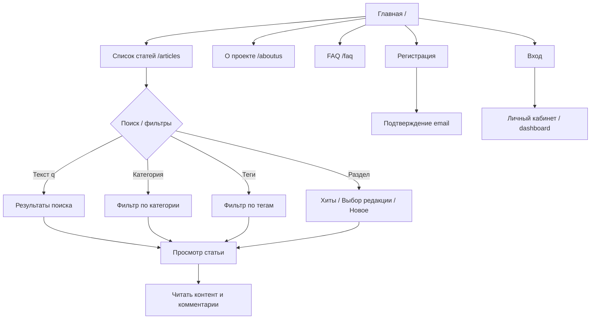
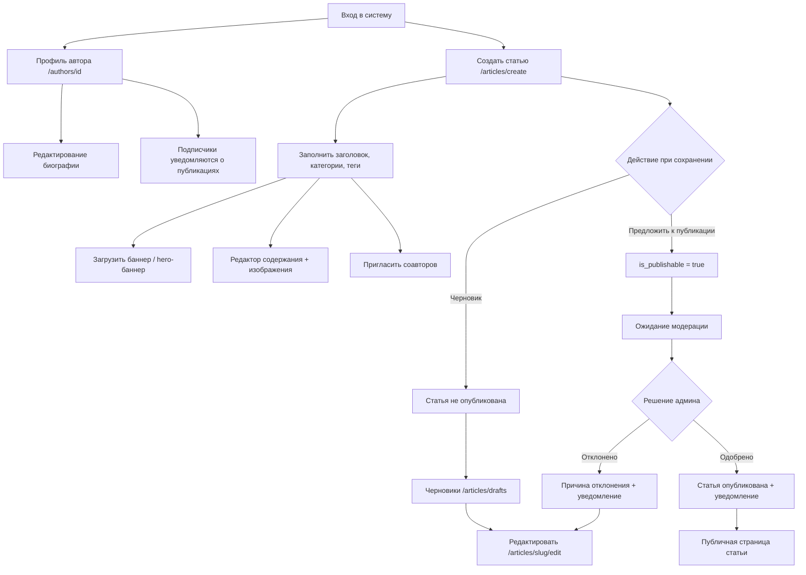
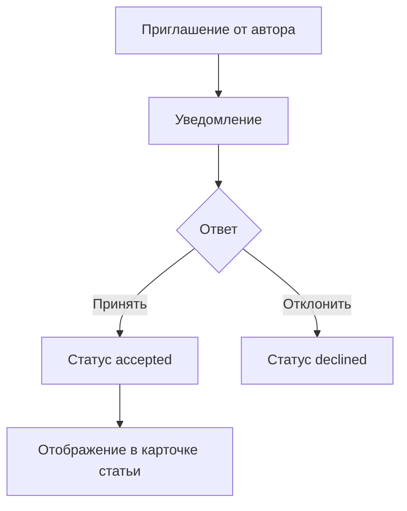
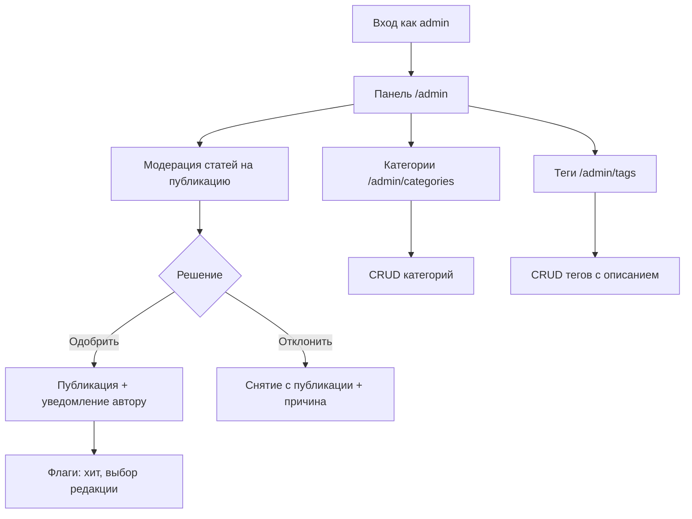
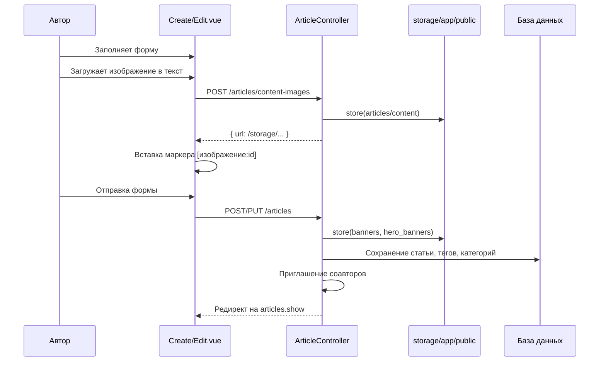
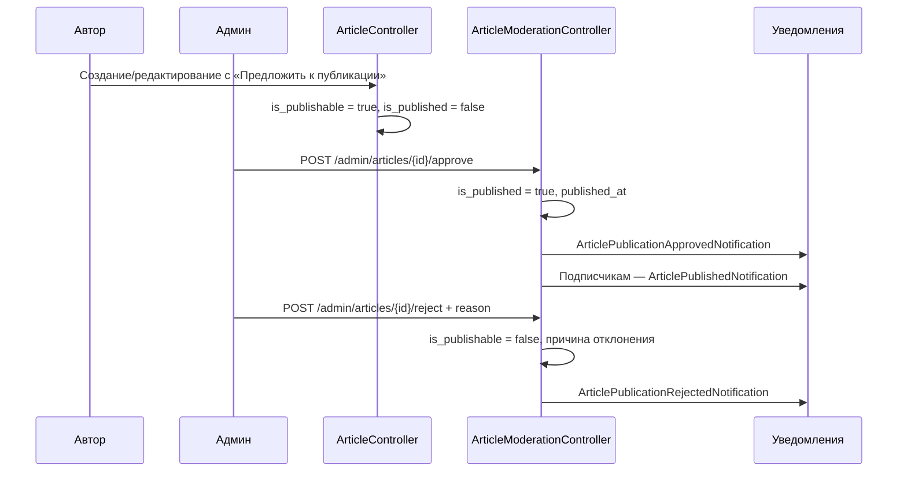
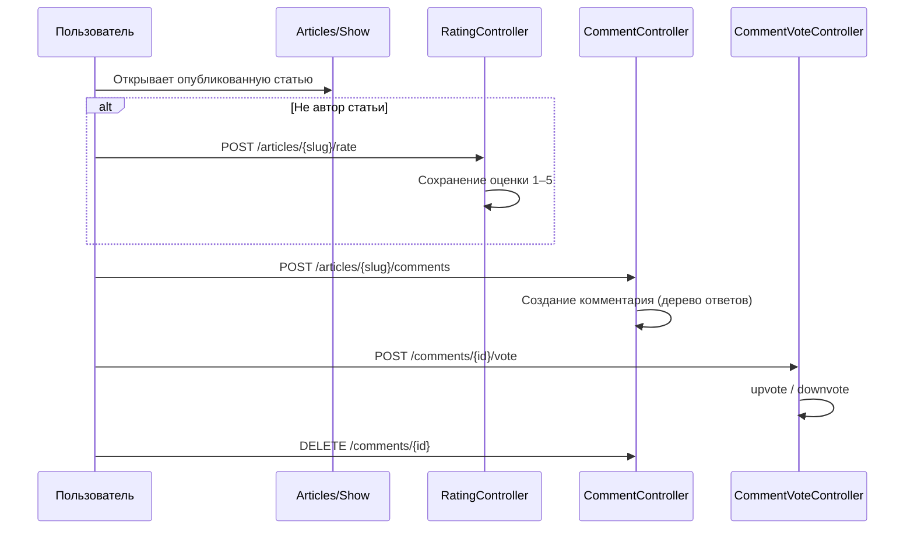
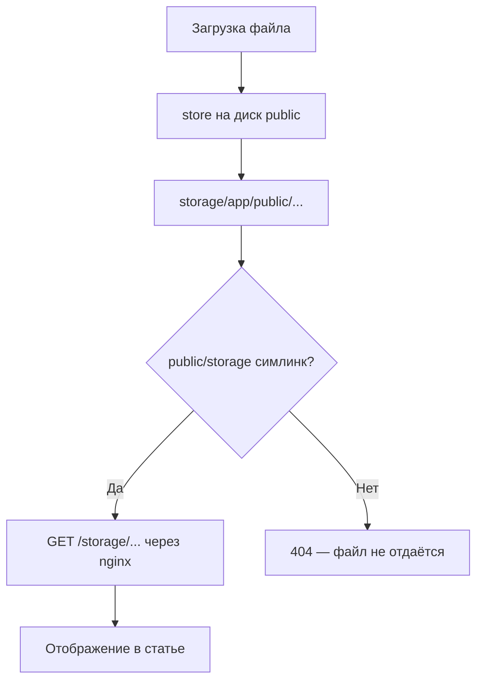

# Схемы пользовательских и задачных потоков — портал КИИСА

Документ описывает основные сценарии работы с информационным порталом КИИСА (Laravel + Vue/Inertia).

---

## 1. Пользовательские потоки (User Flow)

### 1.1 Гость



### 1.2 Автор (зарегистрированный пользователь)



### 1.3 Соавтор



### 1.4 Администратор



### 1.5 Авторизованный читатель

```mermaid
flowchart TD
    A[Просмотр статьи] --> B{Действия}
    B --> C[Оценить статью 1–5]
    B --> D[Оставить комментарий]
    B --> E[Голос за/против комментария]
    A --> F[Подписаться на автора]
    F --> G[Уведомления о новых публикациях]
    G --> H[/notifications]
```

---

## 2. Задачные потоки (Task Flow)

### 2.1 Создание и редактирование статьи



### 2.2 Модерация публикации



### 2.3 Поиск и фильтрация статей

```mermaid
flowchart LR
    A[Запрос /articles] --> B{Параметры URL}
    B -->|q| C[ArticleSearchService: ранжирование]
    B -->|category| D[Фильтр по основной/доп. категории]
    B -->|categories[]| E[Фильтр по нескольким категориям]
    B -->|tags[]| F[Фильтр по тегам AND/OR]
    B -->|section| G[hits / editors_choice / new]
    C --> H[Пагинация 21/63]
    D --> H
    E --> H
    F --> H
    G --> H
    H --> I[ArticleCard + слайдеры категорий]
    A --> J[GET /articles/search-preview]
    J --> K[Быстрый автокомплит заголовков]
```

### 2.4 Комментарии и рейтинг



### 2.5 Хранение и отдача изображений (VPS)



---

## 3. Роли и доступ

| Роль | Основные маршруты |
|------|-------------------|
| Гость | `/`, `/articles`, `/articles/{slug}` (только опубликованные), `/login`, `/register` |
| Автор | `+` `/articles/create`, `/articles/drafts`, редактирование своих статей |
| Соавтор | Принятие приглашений, отображение в статье |
| Админ | `+` `/admin`, модерация, таксономия, публикация напрямую |
