# Диаграммы потоков — портал КИИСА

На основе `routes/web.php`, `routes/auth.php`, контроллеров в `app/Http/Controllers/` и страниц в `resources/js/Pages/`.

---

## TaskFlow: Создание и редактирование статьи

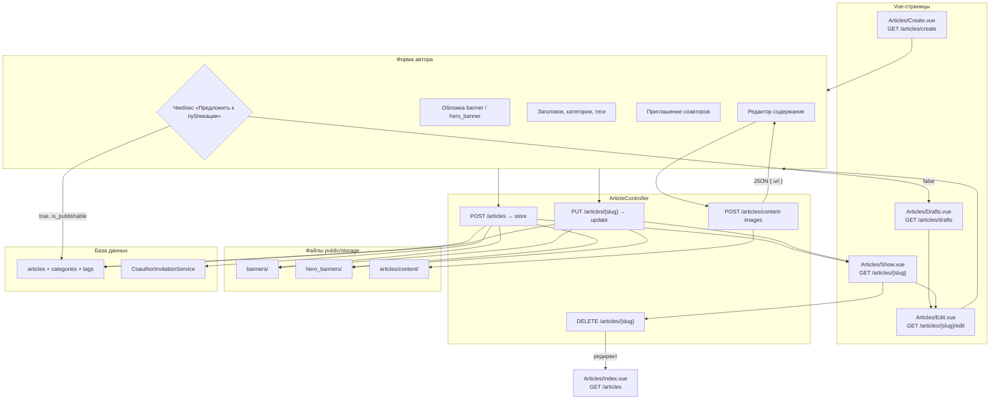

---

## TaskFlow: Модерация и публикация

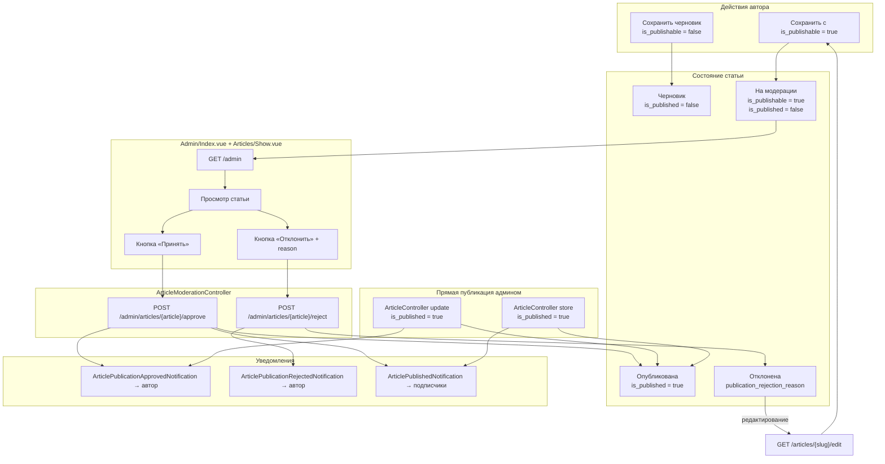

---

## TaskFlow: Поиск и фильтрация статей

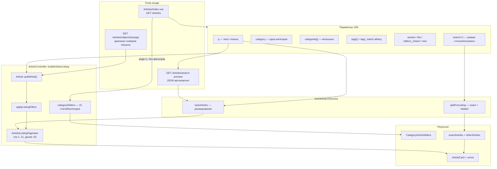

---

## TaskFlow: Комментарии к статье

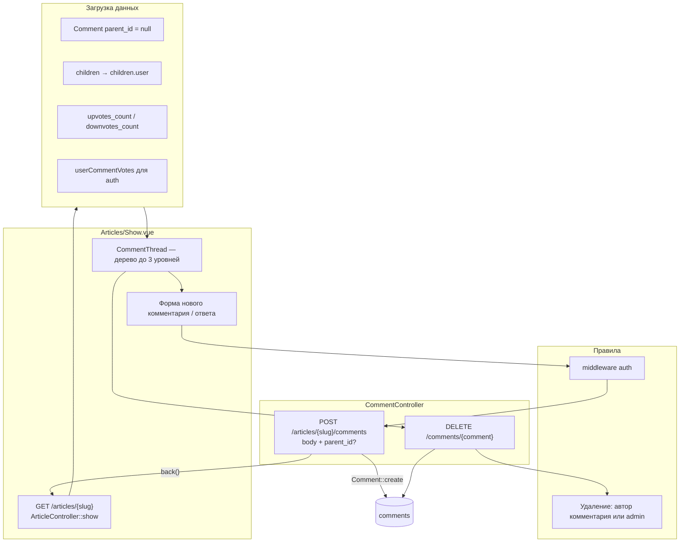

---

## TaskFlow: Рейтинг статей (1–5)

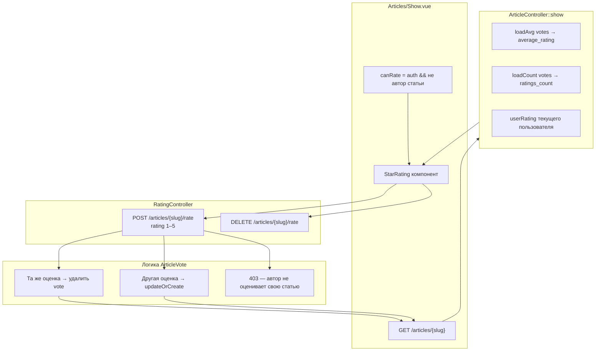

---

## TaskFlow: Голосование за комментарии

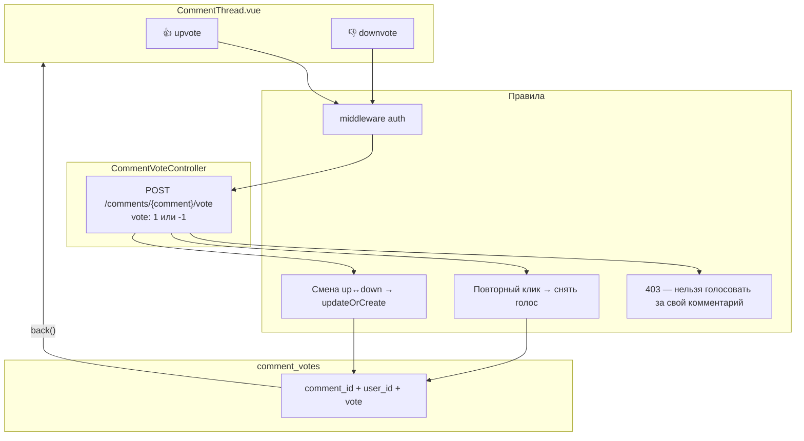

---

## TaskFlow: Аутентификация и регистрация

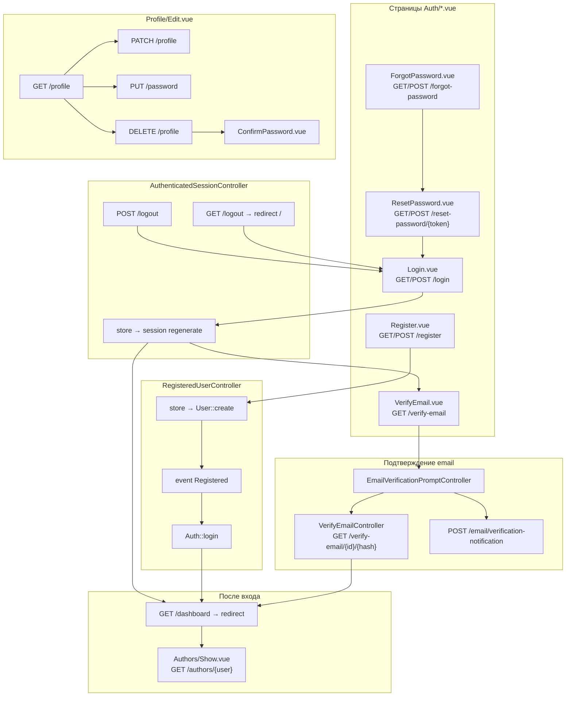

---

## TaskFlow: Админ — таксономия (категории и теги)

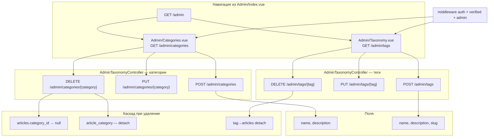

---

## TaskFlow: Соавторы

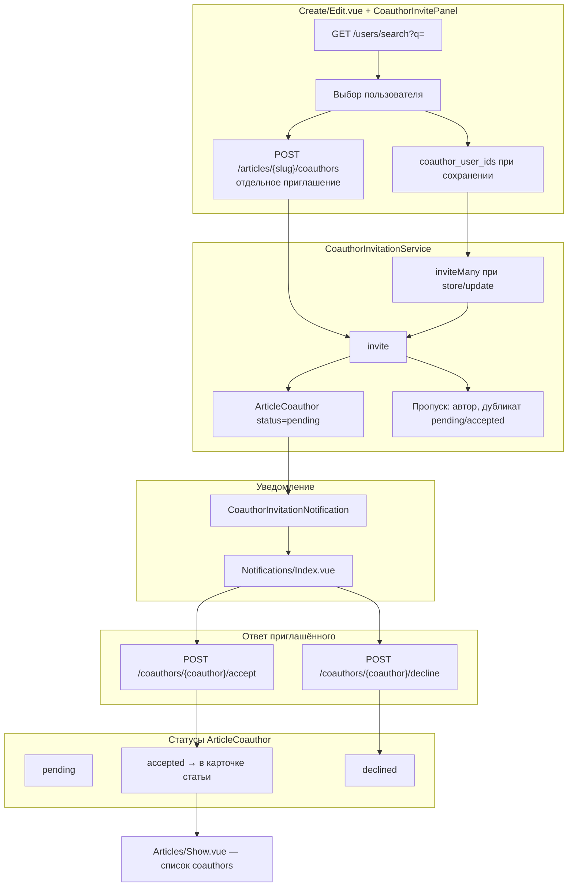

---

## TaskFlow: Уведомления и подписки на авторов

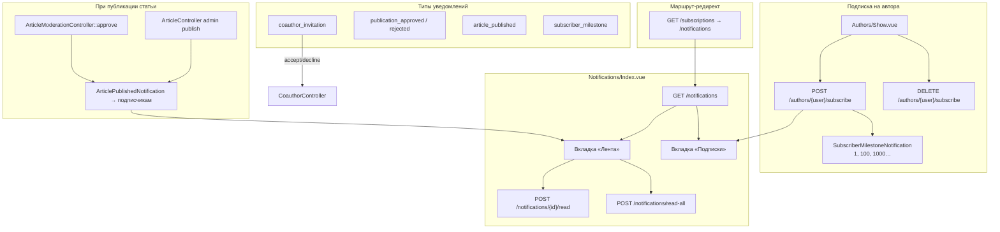

---

## UserFlow: Гость (неавторизованный)

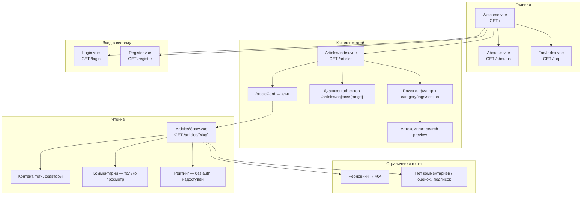

---

## UserFlow: Зарегистрированный автор

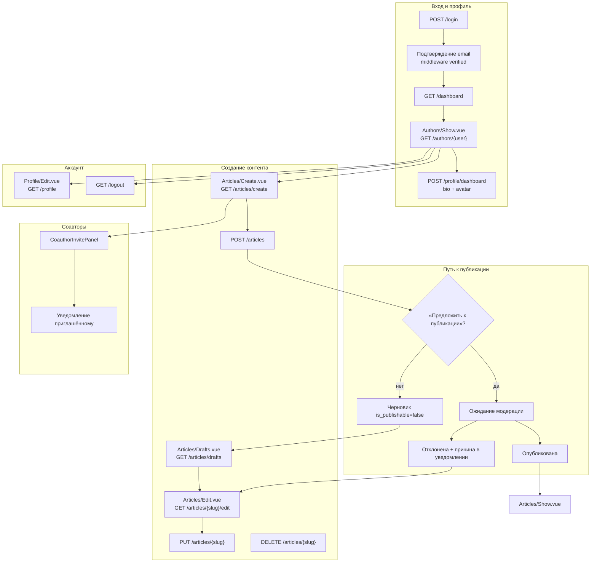

---

## UserFlow: Авторизованный читатель

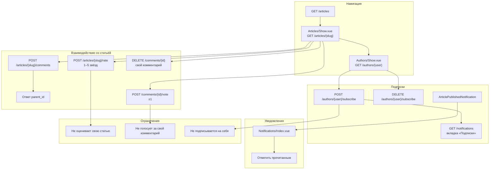

---

## UserFlow: Соавтор

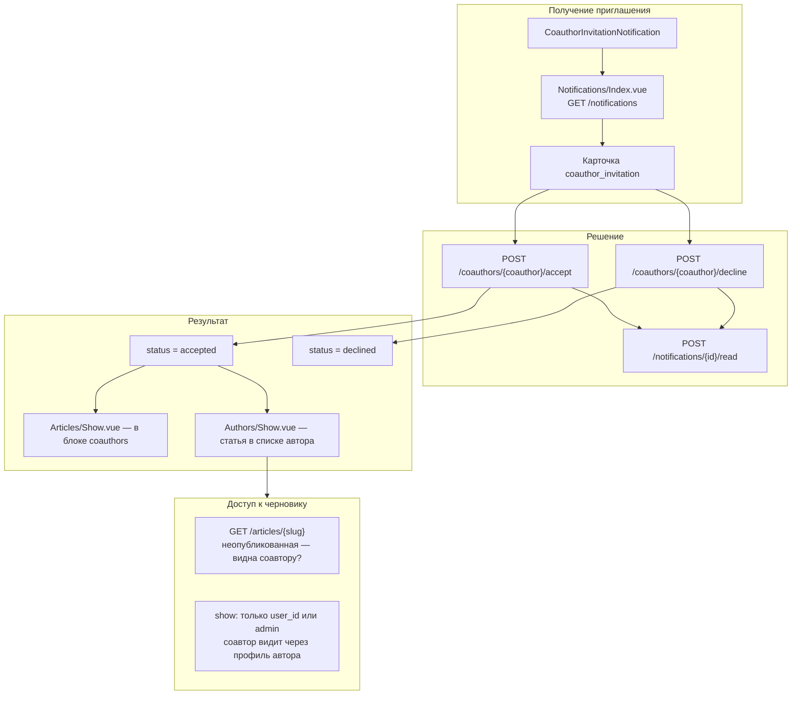

---

## UserFlow: Администратор

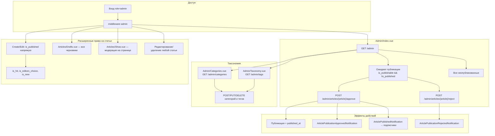

---

## Справка по ключевым маршрутам

| Область | Маршруты | Контроллер / страница |
|--------|----------|------------------------|
| Статьи | `/articles`, `/articles/{slug}`, `/articles/create`, `/articles/drafts` | `ArticleController`, `Articles/*` |
| Модерация | `/admin`, `/admin/articles/{article}/approve\|reject` | `AdminController`, `ArticleModerationController`, `Admin/Index.vue` |
| Комментарии | `POST/DELETE comments` | `CommentController`, `CommentThread` |
| Рейтинг | `POST/DELETE /articles/{slug}/rate` | `RatingController`, `StarRating` |
| Auth | `/login`, `/register`, `/verify-email`, `/profile` | `Auth/*`, `Profile/Edit.vue` |
| Подписки | `/authors/{user}/subscribe`, `/notifications` | `SubscriptionController`, `NotificationController` |
| Соавторы | `/users/search`, `/coauthors/{id}/accept\|decline` | `CoauthorController`, `CoauthorInvitePanel` |
