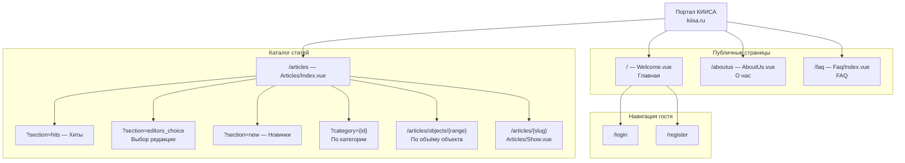
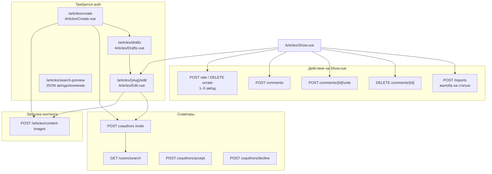
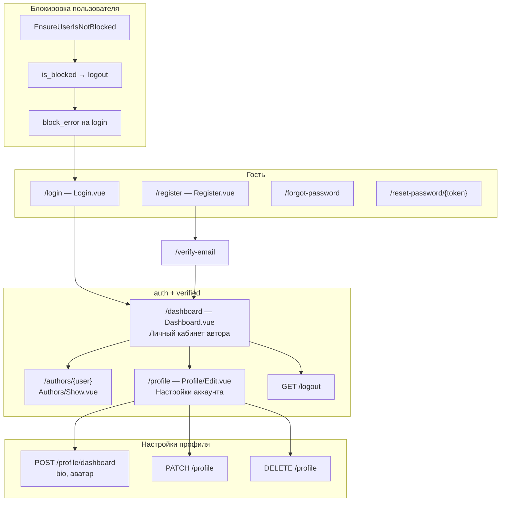
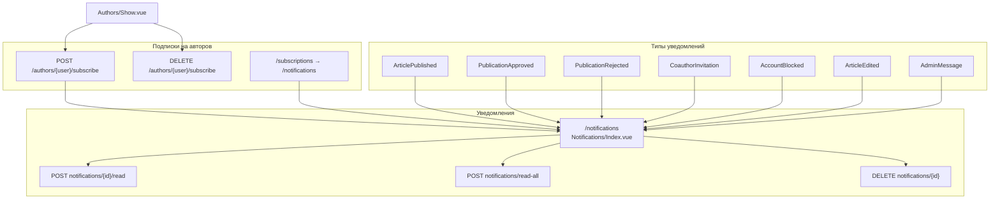
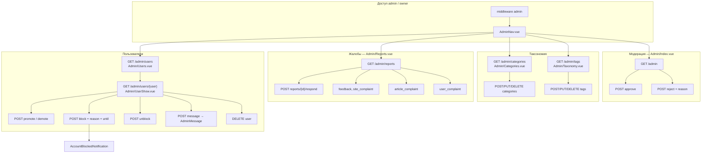

# Карта сайта — портал КИИСА

Документация структуры приложения на основе `routes/web.php`, `routes/auth.php` и страниц `resources/js/Pages/`.

**SEO sitemap (публичные URL):** `public/sitemap.xml`  
**Диаграммы для Word:** `docs/diagrams/svg/sitemap-*.svg` — перегенерация: `node scripts/generate-sitemap-diagrams.mjs`

---

## Легенда доступа

| Уровень | Описание |
|---------|----------|
| **Публичный** | Доступ без авторизации |
| **auth** | Требуется вход |
| **verified** | Вход + подтверждённый email |
| **admin** | Роль admin или owner |

Динамические URL (`/articles/{slug}`, `/authors/{user}`) не включены в `public/sitemap.xml` — они индексируются через контент и внутренние ссылки.

---

## Публичные страницы (SEO)

| URL | Имя маршрута | Vue-страница | В sitemap.xml |
|-----|--------------|--------------|---------------|
| `/` | `/` | Welcome.vue | ✓ |
| `/articles` | articles.index | Articles/Index.vue | ✓ |
| `/articles/objects/{range}` | articles.objects | Articles/Index.vue | — |
| `/articles/{slug}` | articles.show | Articles/Show.vue | — |
| `/aboutus` | aboutus | AboutUs.vue | ✓ |
| `/faq` | faq.index | Faq/Index.vue | ✓ |

Параметры `/articles`: `section` (hits, editors_choice, new), `category`, `q` (поиск).

---

## Аутентификация (guest / auth)

| URL | Имя маршрута | Vue-страница | Доступ |
|-----|--------------|--------------|--------|
| `/login` | login | Auth/Login.vue | guest |
| `/register` | register | Auth/Register.vue | guest |
| `/forgot-password` | password.request | Auth/ForgotPassword.vue | guest |
| `/reset-password/{token}` | password.reset | Auth/ResetPassword.vue | guest |
| `/verify-email` | verification.notice | Auth/VerifyEmail.vue | auth |
| `/verify-email/{id}/{hash}` | verification.verify | — | auth, signed |
| `/confirm-password` | password.confirm | Auth/ConfirmPassword.vue | auth |
| `/logout` | logout | — (GET, редирект) | verified |

---

## Личный кабинет и профиль (verified)

| URL | Имя маршрута | Vue-страница | Доступ |
|-----|--------------|--------------|--------|
| `/dashboard` | dashboard | Dashboard.vue (profile) | auth, verified |
| `/authors/{user}` | authors.show | Authors/Show.vue | verified |
| `/profile` | profile.edit | Profile/Edit.vue | verified |
| `/notifications` | notifications.index | Notifications/Index.vue | verified |
| `/subscriptions` | — | редирект → `/notifications` | verified |

POST: `/profile/dashboard` (bio), `/profile` (update), DELETE `/profile` (destroy), подписки, уведомления (read/read-all/destroy).

---

## Статьи — действия автора (auth)

| URL | Имя маршрута | Vue-страница | Доступ |
|-----|--------------|--------------|--------|
| `/articles/drafts` | articles.drafts | Articles/Drafts.vue | auth |
| `/articles/create` | articles.create | Articles/Create.vue | auth |
| `/articles/{slug}/edit` | articles.edit | Articles/Edit.vue | auth |
| `/articles/search-preview` | articles.search-preview | — (JSON) | auth |

POST/PUT/DELETE: store, update, destroy, content-images, coauthors, rate, comments, reports.

---

## Соавторы и жалобы (auth)

| URL | Имя маршрута | Доступ |
|-----|--------------|--------|
| `/users/search` | users.search | auth |
| `/articles/{slug}/coauthors` | articles.coauthors.invite | auth |
| `/coauthors/{coauthor}/accept` | coauthors.accept | auth |
| `/coauthors/{coauthor}/decline` | coauthors.decline | auth |
| `/reports` | reports.store | auth (FeedbackModal, жалобы) |
| `/messages/{message}/reply` | messages.reply | auth |

Типы жалоб: `article_complaint`, `user_complaint`, `feedback`, `site_complaint`.

---

## Админ-панель (auth + admin)

| URL | Имя маршрута | Vue-страница |
|-----|--------------|--------------|
| `/admin` | admin.index | Admin/Index.vue |
| `/admin/categories` | admin.categories | Admin/Categories.vue |
| `/admin/tags` | admin.taxonomy | Admin/Taxonomy.vue |
| `/admin/reports` | admin.reports.index | Admin/Reports.vue |
| `/admin/users` | admin.users.index | Admin/Users.vue |
| `/admin/users/{user}` | admin.users.show | Admin/UserShow.vue |

POST: модерация статей (approve/reject), CRUD категорий и тегов, respond на жалобы, promote/demote/block/unblock/destroy/message пользователей.

Блокировка: middleware `EnsureUserIsNotBlocked` — разлогин и редирект на login с `block_error`.

---

## SiteMap: Общая структура и публичные страницы

---

## SiteMap: Статьи — создание и взаимодействие

---

## SiteMap: Аутентификация и личный кабинет

---

## SiteMap: Уведомления и подписки

---

## SiteMap: Админ-панель

